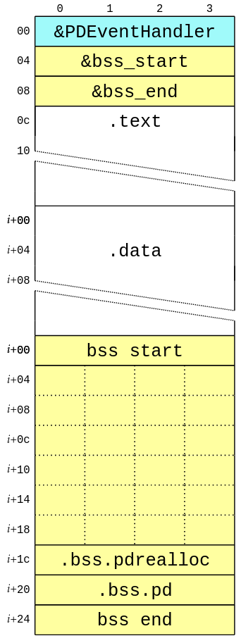

# Binary Structure

TLDR; the compiled binary looks like this (Note that address `0x0` is actually `0x60000000` when run on hardware):



What this means is that:
- the first word in the binary ust be a pointer to our "event handler"
- the second word points to the start of our program globals
- the third word points to the end of program globals

Offhand I'm not sure the purpose of the runtime knowing the beginning + end of
the program global data, unless they're extending the heap to use that space
or something.

What we also learned from the [game.map](./game.map) is that we're going
to be shoving a ton of extra runtime stuff for the hard float random stuff
into the binary we're producing (`Life` uses `rand()`). The source for all that
included code can be found in the `gcc` source tree.

## Game Binary

When the game is mapped into memory the runtime then calls the game's provided
event handler with the init event. So execution flow looks something like:

```
- loadGame()
- initGame()
    - game.eventHandler(&self, kEventInit, 0)
        - eventHandlerShim(pd, evt, arg)
            - eventHandler(pd, evt, arg)
```

from `setup.c` we know that `eventHandlerShim()` is just:

```c
int eventHandlerShim(PlaydateAPI* playdate, PDSystemEvent event, uint32_t arg)
{
	if ( event == kEventInit )
		pdrealloc = playdate->system->realloc;
	
	return eventHandler(playdate, event, arg);
}
```

Whih is a little disappointing that they add the extra function call overhead as its only going to be used once per game session. So this is an interesting overhead addition after they (Panic Inc.) have already shown that they are both:

- willing to add extra sections to emitted game binary
- willing to arrange sections and add extra pointers to game binary

Some alternatives that could reduce this (small, but passive and unavoidable) runtime overhead (ignoring the rest of the time spent in the play.date OS interrupts + runtime etc.) could be things like:

- add a pointer to `.bss.pdrealloc` in `.capi`, so the runtime can overwite it itself
- move the realloc function during the link step to change it's section, then overwrite it (though the previous idea would be considerably easier)

Either way, the game program is a self contained image that is not PIC (poisiton independant code), but based at `0x60000000`, and is provided a pointer to
the playdate api each "interrupt."