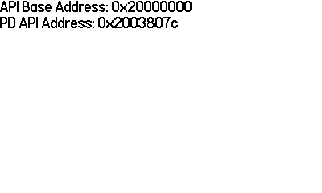

# Game Console

We know that new games get delivered over Wi-Fi, and that
[there is an ESP8266]() onboard, but there is also no interface to communicate
with it voa the play.date SDK, so we'll have to do a little digging and try to
look at the underlying operating system.

To do that we're going to need to write some code to figure out where the
OS is stored, where the heap is, where code objects are, which flash banks are being used, whch hardware is being used etc.

We do know that the [ESP8266 is connected via UART](), and we also know that
there is a [peripheral accelerometer]()  onboard as well.

# Flash banks used


# RAM banks used
## No-risk-no-crash
To determine valid memory address ranges in RAM, we can start with a couple of easy no-crash-no-risk methods.

- Use the `PlaydateAPI` address
- Walk the stack

### Using the PlaydateAPI address
Using the pointer provided to our event handler we can mask off the lower bits
and find which RAM bank the heap with the playdate object is in (or stack address / flash address
if its not stored on the heap, TBD)

Using some quick n dirty C we can dump the address to the screen like below:



C snippet:

```c
static void log_addresses(PlaydateAPI *pd)
{
    char * api_base;
    char * pd_address;

    // create the statements
    pd->system->formatString(&api_base, "API Base Address: %p", (uint32_t)pd & 0xf0000000);
    pd->system->formatString(&pd_address, "PD API Address: %p", pd);    

    // write the statements
    write_line(pd, api_base);
    write_line(pd, pd_address);

    // free the statements
    FREE(api_base);
    FREE(pd_address);
}
```

So, this is cool. Instead of being a dynamically allocated object or a
populated struct, its just hardcoded in a flash region. Cool.

What this tells us is that the `0x20000000` region is valid flash, so
we could probably skip the rest of these methods to get the code for the OS,
but let's do it anyways.

### Walking the stack
- [ ] Make an example program to show what the stack config is going to look like
- [ ] Make one that visualizes the stack in game
- [ ] Traverse and yolo

This is a fun exercise of walking the stack, intuitively we will imagine
the stack growing down, as the addresses decrease the more items you add.
Note that because we are executing exclusively in `Thumb2` mode
the calling convention / ABI that will be used on the play.date is
documented [here](https://developer.arm.com/documentation/dui0041/c/Thumb-Procedure-Call-Standard/About-the-Thumb-Procedure-Call-Standard).

You should probably skim this real quick before continuing.

Note this fun highlight from the docs:
> `fp` is usually not used in Thumb state

And note the register names they use:

|Register | TPCS name | TPCS role |
|--|--|--|
|r0 | a1 | argument 1/scratch register/result |
|r1 | a2 | argument 2/scratch register/result |
|r2 | a3 | argument 3/scratch register/result |
|r3 | a4 | argument 4/scratch register/result |
|r4 | v1 | register variable |
|r5 | v2 | register variable |
|r6 | v3 | register variable |
|r7 | v4/wr | register variable/work register in function entry/exit |
|r8 | (v5) | (ARM v5 register, no defined role in Thumb) |
|r9 | (v6) | (ARM v6 register, no defined role in Thumb) |
|r10 | sl (v7) |stack limit |
|r11 | fp (v8) |frame pointer (usually not used in Thumb state) |
|r12 | (ip) | (ARM ip register, no defined role in Thumb. May be used as a temporary register on Thumb function entry/exit.) |
|r13 | sp | stack pointer (full descending stack) |
|r14 | lr | link register |
|r15 | pc | program counter |

They double down on the no-frame-pointer-use when discussing [control arrival](https://developer.arm.com/documentation/dui0041/c/Thumb-Procedure-Call-Standard/TPCS-definition/Control-arrival):

```
At the instant when control arrives at the target function:

    - pc contains the address of an entry point to the target function.

    - lr contains the value to restore to pc on exit from the function
    (the return link value, see The stack backtrace data structure).

    - sp points at or above the current stack limit. If the limit is
    explicit, sp will point at least 256 bytes above it (see The 
    Stack).

    - If the function is built to use a frame pointer register, fp 
    contains 0 or points to the most recently created stack backtrace 
    structure (see The stack backtrace data structure). This is not 
    usual in Thumb state.

    - The space between sp and the stack limit must be readable and 
    writable memory which the called function can use as temporary 
    workspace, and overwrite with any values before the function 
    returns (see The Stack).
```

Note that argument passing is more or less standard for a computer
architecture, (well at least nothing is too out of the ordinary as
specified in the [argument passing](https://developer.arm.com/documentation/dui0041/c/Thumb-Procedure-Call-Standard/TPCS-definition/Data-representation-and-argument-passing) document, though there
are many real-world cases where that is not honored, not too worried about that here though).

```
At the instant control arrives at the target function, the argument 
list is allocated as follows:

    - the first four argument words (or fewer if there are fewer than 
    four argument words remaining in the argument list) are in machine 
    registers a1-a4

    - the remainder of the argument list (if any) is in memory, at the 
    location addressed by sp and higher addressed words thereafter.

    - A floating-point value is treated as one, two, or three integer 
    values, as appropriate to its precision. The TPCS does not support 
    the passing or returning of floating-point values in ARM 
    floating-point registers.
```

And last but not least, [control return](https://developer.arm.com/documentation/dui0041/c/Thumb-Procedure-Call-Standard/TPCS-definition/Control-return)
```
When the return link value for a function call is placed in the pc:

    - sp, fp, sl, v6, v5, and v1-v4 contain the same values as they 
    did at the instant of control arrival. If the function returns a 
    simple value of size one word or less, the value is contained in 
    a1.

    - If the function returns a simple value of size one word or less, 
    then the value must be in a1. A language implementation is not 
    obliged to consider all single-word values simple. See Non-simple 
    value return.

    - If the function returns a simple floating-point value, the value 
    is encoded in a1, {a1, a2}, or {a1, a2, a3}, depending on its 
    precision.
```

## Yolo swaggins methods
- read from the pages
    then range
- look @ config stuffs
good time to check the current permission bits when running the game
whats allowed/  enabled vs not


# Connected peripherals

# Putting it all together