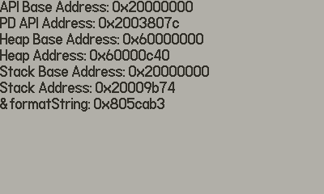
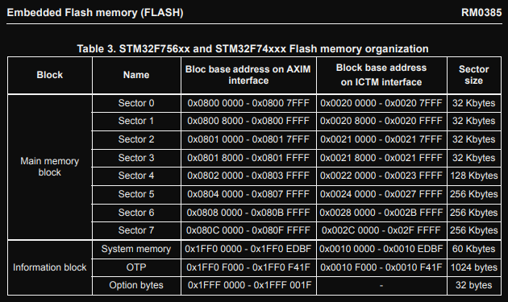

# Finding Valid Memory
To determine valid memory address ranges in RAM, we can start with a couple of easy no-crash-no-risk methods before just yolo touching different regions to see
if the play.date crashes or not

First we're going to try

- Using the `PlaydateAPI` address to get valid regions
- Using allocator memory to get a valid region
- Get the stack memory
- Look at function addresses to see where valid code space is
- Walk the stack

## Using the PlaydateAPI address
Using the pointer provided to our event handler we can mask off the lower bits
and find which RAM bank the heap with the playdate object is in (or stack address / flash address
if its not stored on the heap, TBD)

Using some quick n dirty C we can dump the address to the screen like below:


C snippet:

```c
static void log_addresses(PlaydateAPI *pd)
{
    char * api_base;
    char * pd_address;

    // create the statements
    pd->system->formatString(&api_base, "API Base Address: %p", (uint32_t)pd & 0xf0000000);
    pd->system->formatString(&pd_address, "PD API Address: %p", pd);    

    // write the statements
    write_line(pd, api_base);
    write_line(pd, pd_address);

    // free the statements
    FREE(api_base);
    FREE(pd_address);
}
```

What this tells us is that the pd api is allocated in SRAM (system SRAM
starts at `0x20000000` as per [docs section 2.3](https://www.st.com/resource/en/reference_manual/dm00124865-stm32f75xxx-and-stm32f74xxx-advanced-arm-based-32-bit-mcus-stmicroelectronics.pdf)).
Cool, now that we have some progress, we're going to dump some more
addresses to see what we're working with.

## Using more addresses

Now we're going to still use the pd api address, but now we're going to
allocate something on the heap and use that address as well, and allocate
something on the stack and use that address (Note that the stack is setup
to be only `61800` bytes a la `C_API/buildsupport/*.cmake` and
`C_API/Examples/*/Makefile`).

So, lets see what we got:



corresponding snippet:

```c
static void log_addresses(PlaydateAPI *pd)
{
    char * api_base;
    char * pd_address;
    char * heap_obj;
    char * heap_base;
    char * stack_obj;
    char * stack_base;
    char * code_ptr;

    // create the statements
    pd->system->formatString(&api_base, "API Base Address: %p", (uint32_t)pd & 0xf0000000);
    pd->system->formatString(&pd_address, "PD API Address: %p", pd);
    pd->system->formatString(&heap_base, "Heap Base Address: %p", ((uint32_t)api_base & 0xf0000000));
    pd->system->formatString(&heap_obj, "Heap Address: %p", api_base);
    pd->system->formatString(&stack_base, "Stack Base Address: %p", ((uint32_t)&api_base & 0xf0000000));
    pd->system->formatString(&stack_obj, "Stack Address: %p", &api_base);
    pd->system->formatString(&code_ptr, "&formatString: %p", pd->system->formatString);

    // write the statements
    write_line(pd, api_base);
    write_line(pd, pd_address);
    write_line(pd, heap_base);
    write_line(pd, heap_obj);
    write_line(pd, stack_base);
    write_line(pd, stack_obj);
    write_line(pd, code_ptr);

    // free the statements
    FREE(api_base);
    FREE(pd_address);
    FREE(heap_base);
    FREE(heap_obj);
    FREE(stack_base);
    FREE(stack_obj);
    FREE(code_ptr);
}
```

Cool, so this looks like we have a (so far) deterministic stack address
(`0x2003807c`) for the pd api handle, and that the heap objects we
allocate during games are going to be allocated immediately after the
game code (remember that the game is mapped to `0x60000000`) in ram.
Additionally this shows us that the flash region beng used for code
(specifically the flash region that `pd->system->formatString` is in)
is the flash bank that starts at `0x8000000`.

Flash bank table for reference ([section 3.3.1](https://www.st.com/resource/en/reference_manual/dm00124865-stm32f75xxx-and-stm32f74xxx-advanced-arm-based-32-bit-mcus-stmicroelectronics.pdf)):



So what we can glean from this table (and the fact that we can run code on it)
is that we have permission to access the memory and execute it (haven't seen
many things that allow execute only permissions), and that the entire flash
region is from address `0x08000000` to `0x080FFFFF`). So we can probably just
dump all that code right now if we wanted to, BUT we still have a fun exercise
comming up.

## Walking the stack

This is a fun exercise of walking the stack, intuitively we will imagine
the stack growing down, as the addresses decrease the more items you add.
Note that because we are executing exclusively in `Thumb2` mode
the calling convention / ABI that will be used on the play.date is
documented [here](https://developer.arm.com/documentation/dui0041/c/Thumb-Procedure-Call-Standard/About-the-Thumb-Procedure-Call-Standard).

You should probably skim this real quick before continuing.

Note this fun highlight from the docs:
> `fp` is usually not used in Thumb state

And note the register names they use:

|Register | TPCS name | TPCS role |
|--|--|--|
|r0 | a1 | argument 1/scratch register/result |
|r1 | a2 | argument 2/scratch register/result |
|r2 | a3 | argument 3/scratch register/result |
|r3 | a4 | argument 4/scratch register/result |
|r4 | v1 | register variable |
|r5 | v2 | register variable |
|r6 | v3 | register variable |
|r7 | v4/wr | register variable/work register in function entry/exit |
|r8 | (v5) | (ARM v5 register, no defined role in Thumb) |
|r9 | (v6) | (ARM v6 register, no defined role in Thumb) |
|r10 | sl (v7) |stack limit |
|r11 | fp (v8) |frame pointer (usually not used in Thumb state) |
|r12 | (ip) | (ARM ip register, no defined role in Thumb. May be used as a temporary register on Thumb function entry/exit.) |
|r13 | sp | stack pointer (full descending stack) |
|r14 | lr | link register |
|r15 | pc | program counter |

They double down on the no-frame-pointer-use when discussing [control arrival](https://developer.arm.com/documentation/dui0041/c/Thumb-Procedure-Call-Standard/TPCS-definition/Control-arrival):

```
At the instant when control arrives at the target function:

    - pc contains the address of an entry point to the target function.

    - lr contains the value to restore to pc on exit from the function
    (the return link value, see The stack backtrace data structure).

    - sp points at or above the current stack limit. If the limit is
    explicit, sp will point at least 256 bytes above it (see The 
    Stack).

    - If the function is built to use a frame pointer register, fp 
    contains 0 or points to the most recently created stack backtrace 
    structure (see The stack backtrace data structure). This is not 
    usual in Thumb state.

    - The space between sp and the stack limit must be readable and 
    writable memory which the called function can use as temporary 
    workspace, and overwrite with any values before the function 
    returns (see The Stack).
```

Note that argument passing is more or less standard for a computer
architecture, (well at least nothing is too out of the ordinary as
specified in the [argument passing](https://developer.arm.com/documentation/dui0041/c/Thumb-Procedure-Call-Standard/TPCS-definition/Data-representation-and-argument-passing) document, though there
are many real-world cases where that is not honored, not too worried about that here though).

```
At the instant control arrives at the target function, the argument 
list is allocated as follows:

    - the first four argument words (or fewer if there are fewer than 
    four argument words remaining in the argument list) are in machine 
    registers a1-a4

    - the remainder of the argument list (if any) is in memory, at the 
    location addressed by sp and higher addressed words thereafter.

    - A floating-point value is treated as one, two, or three integer 
    values, as appropriate to its precision. The TPCS does not support 
    the passing or returning of floating-point values in ARM 
    floating-point registers.
```

And last but not least, [control return](https://developer.arm.com/documentation/dui0041/c/Thumb-Procedure-Call-Standard/TPCS-definition/Control-return)
```
When the return link value for a function call is placed in the pc:

    - sp, fp, sl, v6, v5, and v1-v4 contain the same values as they 
    did at the instant of control arrival. If the function returns a 
    simple value of size one word or less, the value is contained in 
    a1.

    - If the function returns a simple value of size one word or less, 
    then the value must be in a1. A language implementation is not 
    obliged to consider all single-word values simple. See Non-simple 
    value return.

    - If the function returns a simple floating-point value, the value 
    is encoded in a1, {a1, a2}, or {a1, a2, a3}, depending on its 
    precision.
```

SO, time to cry. basically because by default thumb mode omit's the frame
pointer theres not going to be frame's to jump back to. Instead of doing
some fun tricks and heuristics to figure out what our frames are, we're just
going to dump flash. Because I don't want to think that hard.

But we know that we can read the flash section, and we know that the
onboard `SRAM` is used for the stack, and that the `0x60000000` region that
our code gets mapped to is where our heap is.