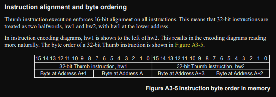
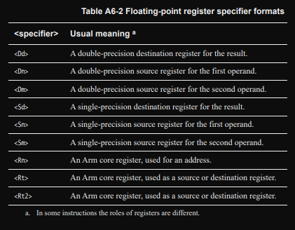
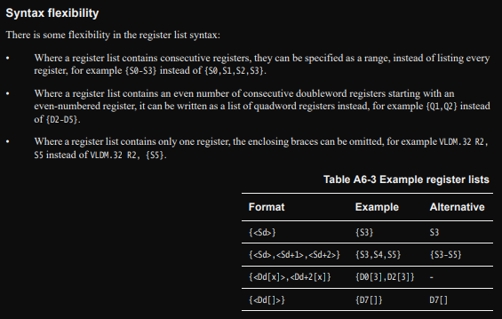
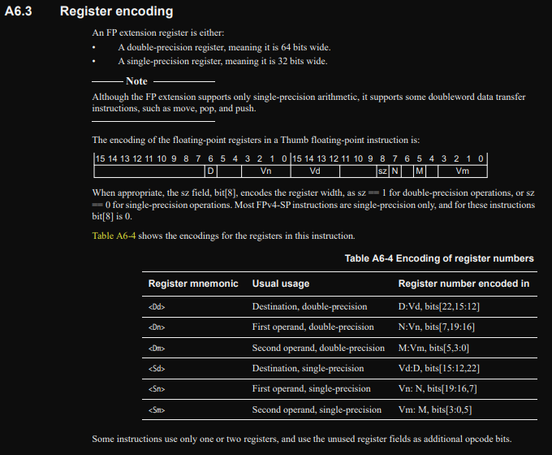

# FPv5 meet world
# Opcode patterns from the docs

Going through the [ARMv7M spec](https://developer.arm.com/documentation/ddi0403/latest)
there are a few things we need to keep in mind:

### Instruction alignment / byte ordering:

The important bits are the **"byte at address `A + n`"**

### When reading the instruction decodings from the manual:

### Rude "syntax flexibilities" to make things oh so much clearer:

### FPU register encoding

# Opcode patterns from gcc

# FPv5 meet Binary Ninja
# FPv5 meet Ghidra
# FPv5 meet objdump