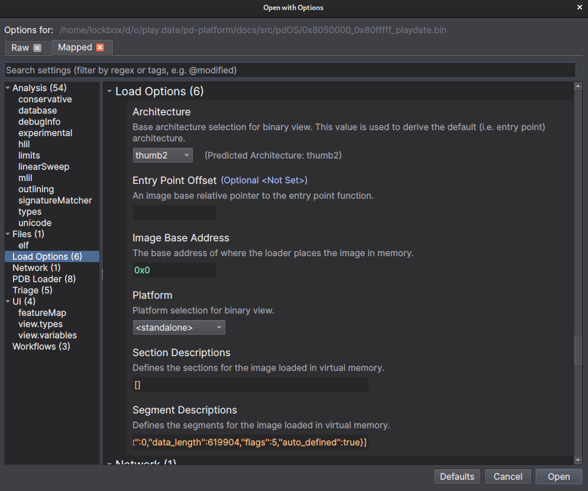
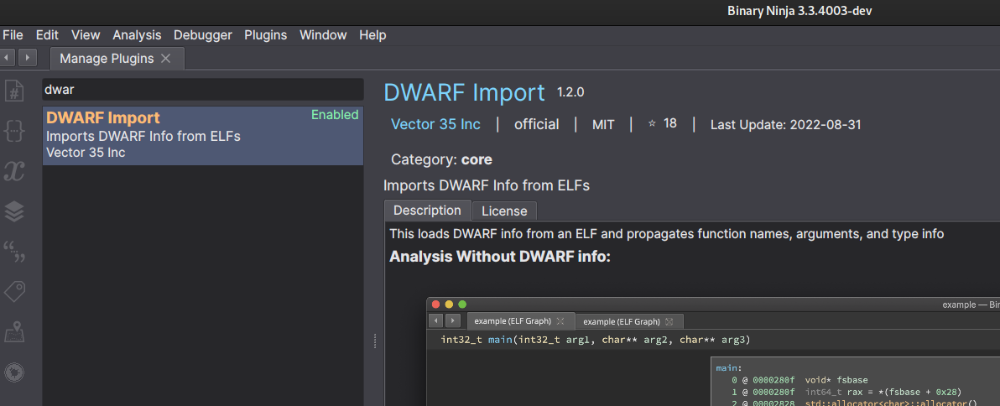
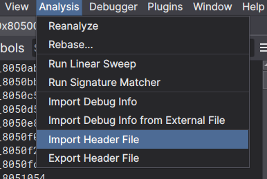
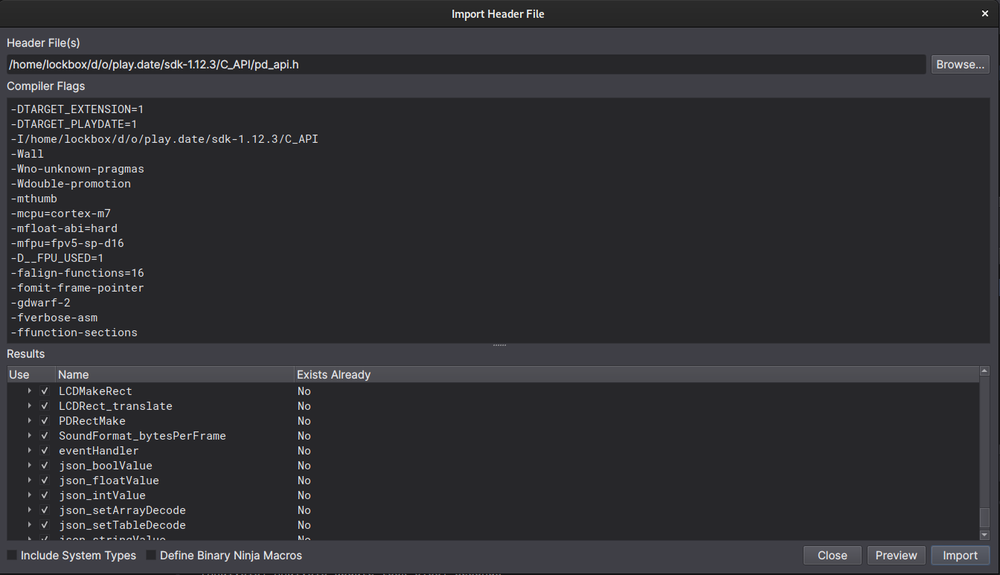
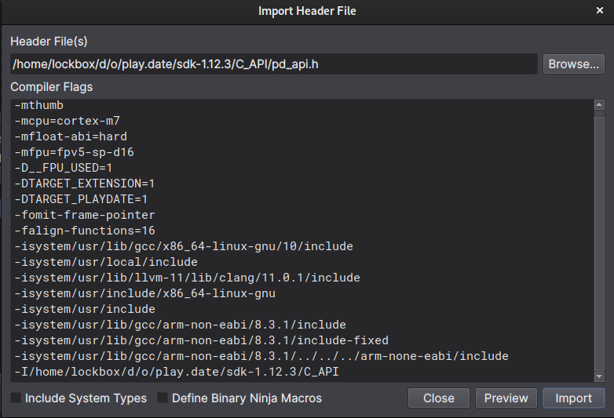
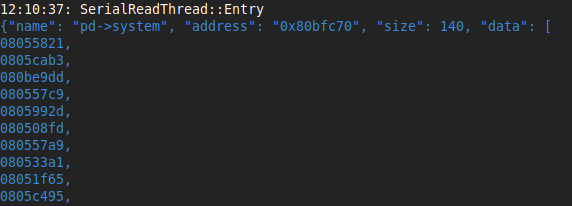
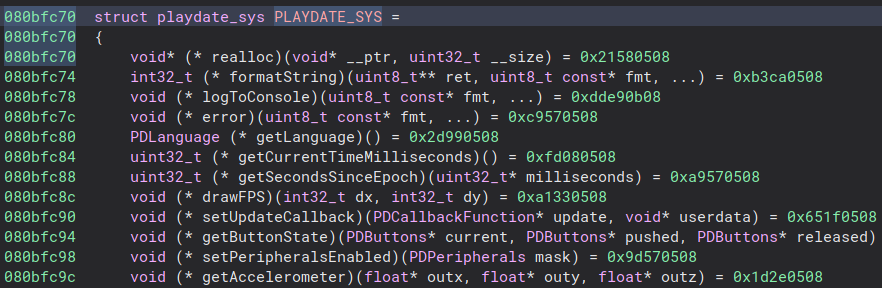
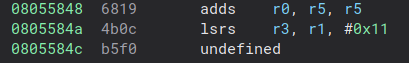

# Triaging User Mode Dump

Before pigeon-holing too hard on something in particular it's good to go over
the goals of what you're doing and what a decent path forward might actually be.
This is especially important for things like reversing an entire OS / bare metal
system where you have interrupts firing all over the place, a ton of third party
code, vendor SDK code, and the actual target code you care about.

SO, in the spirit of "seeing where we're at", we can take a step back and go over
the goals again:

1) Figure out how to talk to Wi-Fi
2) Figure out the limits of being "unprivileged"
3) Kernel mode dump (disclaimer, its not hard - but most likely unnecessary for Wi-Fi)
4) Reverse all the things

So focusing on task 1, there are a few sub tasks that will probably lead to most of the
others getting done in the process.

- Label all the public SDK functions
- Label FreeRTOS functions
- If there are any in user space, find the memfault functions
- Find each of the running threads
- Find the thread that talks to the ESP wifi chip on board
- Figure out which IPC method they use to control that thread

The high level workflow for the intial triage of user space is going to roughly follow:

- look @ `PlaydateSimulator.debug` for type information we can _maybe_ use (
    or at least get a reference for their programming paradigms)
- make a playdate game to dump addresses for all of the documented API's
    - im assuming that some scoreboard api has some Wi-Fi things under the hood
    will probably get us close
- look at `FreeRTOS` source to figure out what some of the syscalls are, then work
    up to the pd api functions
- if there's 0 progress:
    - we can reverse some of the season games to figure out what's going on
    (but that's cheating :p )
    - look for hardcoded [AT commands](https://docs.espressif.com/projects/esp-at/en/latest/esp32/AT_Command_Set/Basic_AT_Commands.html), tried and true "grep flag" basically always works,
    but is suuuper anti-climactic

So without further ado, let's jump in

# Baby's first binary dump
We'll use [binary.ninja](https://binary.ninja) to reverse the code on the playdate,
note that we're in thumb2 mode and our starting offset is not 0. So when we first
open the binary dump we should see this:



Make sure to change the image base address to `0x08050000`.

Also switch it to disassembly so things look clearer - binary ninja is not best suited
for non standard targets, and all disassemblers are notoriously bad at arm / thumb / vfp,
so we'll take it easy on it. Notice how all of the functions aren't named, and things
are all over the place (duh its a binary dump). We have some work to do.

## Step 1 - Applying debug types
The first step is going to be installing the dwarf debug info plugin that
vector35 published, then *ugh* restarting binary ninja. But afterwards we can now import
debug info from the shipped external `PlaydateSimulator.debug` file from the SDK.



And now all the types are applied we can export the types to a header file.

Turning the provided `dwarf2` debug file into a header we get [this](). We can
import the header into binary ninja with some extra flags [as documented below],
and then we will have those as needed hen we find stuff. Note that we probably
won't use those types much in user space but better safe than sorry. Also now
that binary ninja literally [just stabilized](https://binary.ninja/2023/01/18/3.3-the-bytes-must-flow.html#import--export-header-files)
the header / type importing I figured I'd go ahead and give it a whirl.

## Step 1.5 - Importing the SDK C Types
The more useful thing to import into binary ninja for looking at user space is
going to be the `C_API` (specifically the `pd_api.h` header). Note that
binary ninja uses [clang type parser](https://binary.ninja/2022/10/28/3.2-released.html#default-to-clang-type-parser)
for their header importing, so now we can import the headers with the arguments
from the compiler like so:

Import selection is here:



Then add the compiler options:



And it worked (this time), though it failed the first time I tried to, and reading the
[documentation](https://docs.binary.ninja/guide/type.html#import-header-file) shows that
there are extra arguents necessary to add the system types, so you might need to add those.
On my machine it looked like:



Now we can directly use the types directly (instead of hand-jamming them) for the next step:

## Step 2 - Dumping the API addresses
The Playdate API is super nice and user friendly, and is half the reason I started
writing all this stuff up. So now that we've imported all the Playdate `C_API`
types and functions we need to dump the addresses from a real device so we can
properly label them in the memory dump we're reversing in binary ninja.

So to do this we're going to dump all of the tables in the main `PlaydateAPI`
struct (each of the struct members is a pointer to anotherb struct of
function pointers), and afterwards we will use that to label the corresponding
functions in binary ninja.

Corresponding code snippet:

```C
/**
 * \brief macro to dump pointer tables, looks super fancy but all its really doing
 * is:
 *   - starting a json object for the table with the provided name, address, and size.
 *   - dumping each word as 4 zero padded bytes in a hex string as a part of the data
 *     array in the json object
 */
#define LOG_TABLE(__pd, __name, __sz, __ptr)                                                \
    do                                                                                      \
    {                                                                                       \
        WRITE_FCONSOLE(__pd,                                                                \
                       "{\"name\": \"%s\", \"address\": \"%p\", \"size\": %d, \"data\": [", \
                       __name,                                                              \
                       (void *)__ptr,                                                       \
                       __sz);                                                               \
        for (int i = 0; i < __sz / 4; i++)                                                  \
        {                                                                                   \
            WRITE_FCONSOLE(__pd, "\"%08x\",", *(((uint32_t *)__ptr) + i));                  \
        }                                                                                   \
        WRITE_FCONSOLE(__pd, "%s", "]}");                                                   \
    } while (0)

/**
 * \brief dumps a jsonl of symbols to the console
 */
static void log_addresses(PlaydateAPI *pd)
{
    LOG_TABLE(pd, "pd->system", sizeof(struct playdate_sys), pd->system);
    LOG_TABLE(pd, "pd->file", sizeof(struct playdate_file), pd->file);
    LOG_TABLE(pd, "pd->graphics", sizeof(struct playdate_graphics), pd->graphics);
    LOG_TABLE(pd, "pd->sprite", sizeof(struct playdate_sprite), pd->sprite);
    LOG_TABLE(pd, "pd->display", sizeof(struct playdate_display), pd->display);
    LOG_TABLE(pd, "pd->sound", sizeof(struct playdate_sound), pd->sound);
    LOG_TABLE(pd, "pd->lua", sizeof(struct playdate_lua), pd->lua);
    LOG_TABLE(pd, "pd->json", sizeof(struct playdate_json), pd->json);
    LOG_TABLE(pd, "pd->scoreboards", sizeof(struct playdate_scoreboards), pd->scoreboards);
    WRITE_FSTRING(pd, "Wrote tables to console", "");
}
```

This will output json for each pointer table, and give us most of the information
we need without doing toooo much work in C. (initially I started dumping the name
of each function as well but that started to be too much in C).

Also I started to get lazy, so we'll just look at the playdate simulator console
and look at the output to line it up with the api headers and binary ninja.

Each function table is going to get dumped in order, so we can just walk down the
list of functions in each struct and directly apply things in binry ninja.

Snapshot:



Cool, we can go back to binary ninja and apply the `playdate_sys` struct type
to the address listed, and hopefully that will just label all the functions for
us like I've previously done in ghidra.



Excuse me tf. The endianness is wrong for the addresses :facepalm:. Joy.
Well I don't know how to fix that (after digging around a bit I couldn't figure it
out, not going to worry about it though since it doesn't really break anything and
you can manually add cross-references - the answer is probably defining a custom data
section that is big endian).

What we can do is manually create the references to all the functions, and manually
define functions at the necessary addresses (note because we are in thumb mode
when we create addresses at the odd addresses binary ninja will correctly create
the function at the odd address - 1, see [here](https://stackoverflow.com/questions/28669905/what-is-the-difference-between-the-arm-thumb-and-thumb-2-instruction-encodings)
for computer engineers getting carried away). Cool let's look at realloc and see if it
worked:



Ummm, great another bug. Failing to disassemble. Fantastic. After repo-ing ghidra, objdump,
capstone and ida, I'm thinking it's probably an issue with a hard float instructions (it
always is lmao). 


The hard float abi used for this mcu is [FPv5](https://developer.arm.com/documentation/ddi0489/b/floating-point-unit/about-the-fpu).
So looks like we're going to need to make some MR's (or PR's in github land). yay.

See [Triaging Hard Float Disassembly](./TriagingHardFloatDisassmbly.md) for more.

In the mean time we can finish labelling all the functions and see where we stand.


Next: [Searching for FreeRTOS code](./SearchingForFreeRTOSCode.md)